# CS464 Assignment 01 · [Your name] · BSCS25107

## Game 1 · Among Us
- **Store link:** [Google Play link](https://play.google.com/store/apps/details?id=com.innersloth.spacemafia)
- **Genre:** Multiplayer, social deduction
- **I played:** 1 hour
- **Video (optional):** [link]

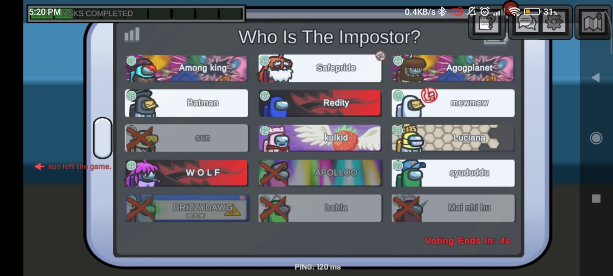
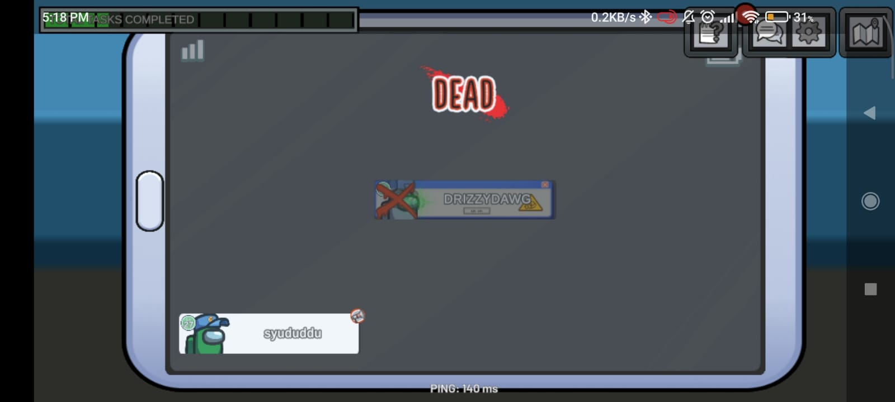
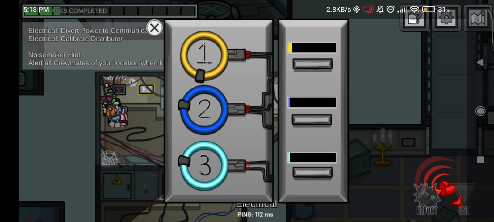
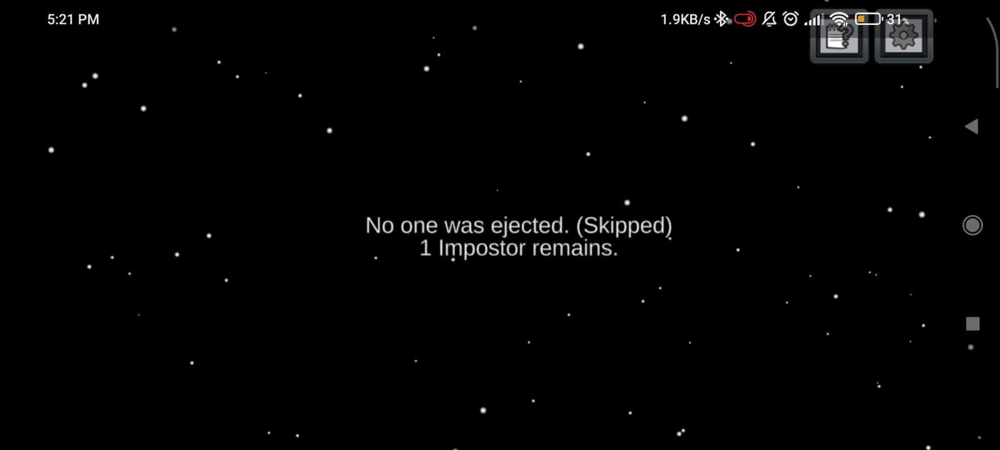
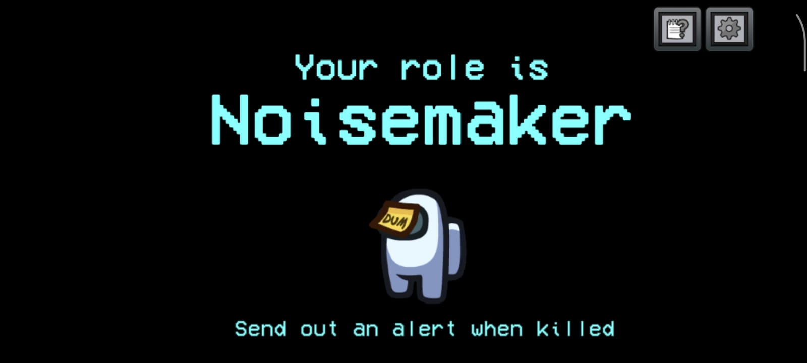
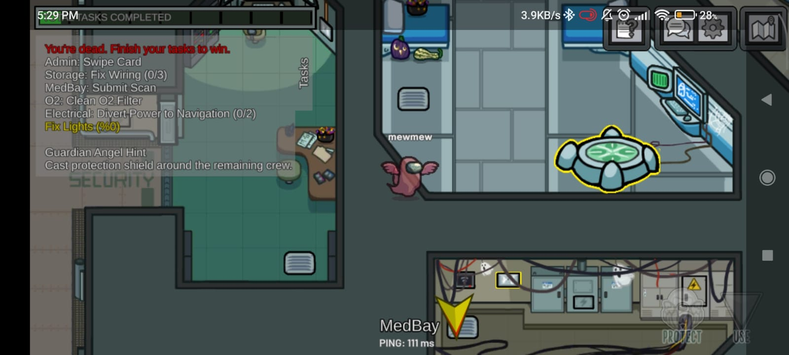
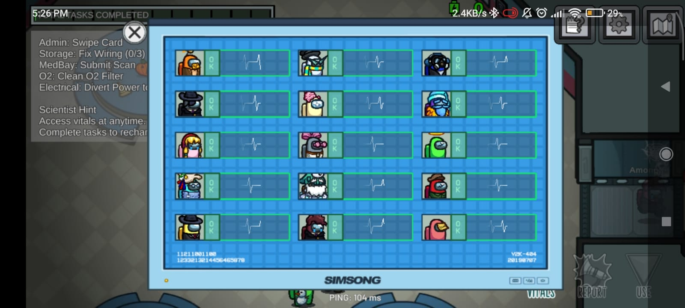
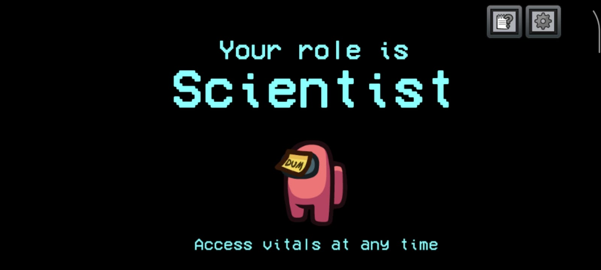

1. [M1, M4] · Divert Power task in Electrical with the task bar at the top and the Noisemaker alert button at the bottom right.
2. [M4] · Role reveal: "Noisemaker: send out an alert when killed".
3. [M3] · Role reveal: "Scientist: access vitals at any time".
4. [M3] · Scientist's Vitals panel showing all 15 players as OK.
5. [M5, M7] · Voting screen with a "Voting Ends In" timer, crossed-out dead players and custom nameplates.
6. [M2, M6] · Ghost state: "You're dead. Finish your tasks to win", with the Guardian Angel hint and PROTECT button.
7. [M5] · Vote result: "No one was ejected (Skipped). 1 Impostor remains."

| # | Mechanic | Dynamic | Aesthetic | Bartle type |
|---|---|---|---|---|
| M1 | Each crewmate gets their own tasks that they have to complete within the game. A task bar shows their progress.| Crewmates walk from room to room to find tasks and can use it as their alibi.| Submission:Simple and enjoyable minigames disguised as tasks to keep you hooked.| Achiever:The task bar fills up as you achieve; it is interacting with the world.|
| M2 |Dead players become ghosts who can pass through walls and keep their task list. |Ghosts cut straight across the map to the next task instead of following the corridors, and drift through rooms to see where the Impostor is. |Fellowship:you still help the crew win after dying.|Achiever:The task bar fills even when dead as you play.|
| M3 | The Scientist role can open the Vitals panel at any time, showing every player as OK or dead. |The Scientist checks vitals to see who just died, then reports it in the meeting. Others ask the Scientist to confirm their alibi.  | Discovery: uncovering hidden information about who is alive. | Explorer: Explores and discovers vital information to help vote out the imposter. |
| M4 |The Noisemaker role sends an alert with its location to all crewmates when it is killed.|Crew rush to the alert area, and the Impostor must flee or avoid killing the Noisemaker near others.  | Challenge:a kill becomes riskier, so the Impostor must plan around it. | Killer:Acting on players as the noise directly inconveniences the imposter.|
| M5 | After a meeting starts, players vote on a suspect from a list. Dead players are crossed out, and a "Voting Ends In" timer counts down.|Players argue, follow the loudest voice,interact and present their alibis to avoid being voted out. | Challenge and Fellowship:Players come together to vote. the vote has a real cost, because ejecting the wrong player helps the Impostor. | Socializer: Players come together to vote.|
| M6 | The Guardian Angel (a dead player's role) can cast a protection shield on a living crewmate. | Ghosts watch the living players, guess who the Impostor will target, and shield that person. Impostors then have to doubt every kill attempt. | Fellowship:
the dead protect the living. | Socializer:Acting for other players. |
| M7 | Players choose their crewmate's colour, hat, skin, pet and nameplate.|Players pick a look that feels like theirs and remember other players by theirs  |Expression: Players show who they are through how their character looks|Socializer: Players show other players.|

**Aesthetic profile:** Fellowship leads (M2, M5, M6): the whole game is a group talking, voting and protecting each other, even after dying. Challenge comes next (M4, M5), because every kill and every vote is a risk that can cost a side the game. Submission (M1) keeps players busy with simple task minigames between meetings.

**Player types**
- Primary: Socializer (interacting × players), because meetings, votes, alibis, shields and looks (M5, M6, M7) all happen between players.
- Secondary: Achiever (acting × world), because the shared task bar only fills when players finish tasks, even as ghosts (M1, M2).

## Game 2 · Candy Crush Saga
- **Store link:** [Google Play link](https://play.google.com/store/apps/details?id=com.king.candycrushsaga)
- **Genre:** Puzzle (match-3), single player
- **I played:** 30-35 minutes
- **Video (optional):** [link]

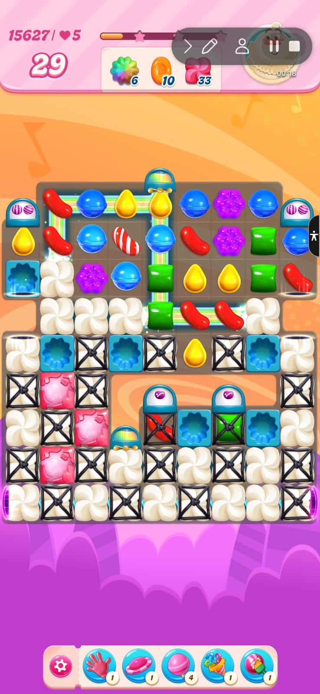
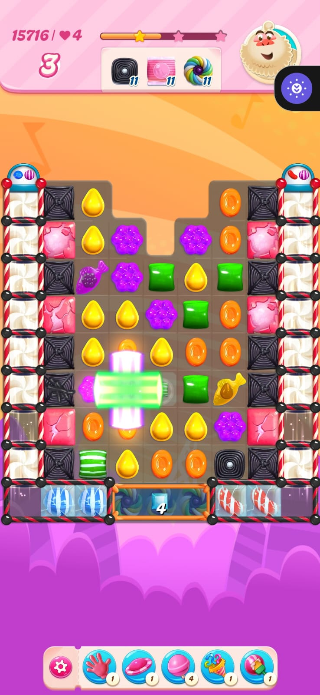
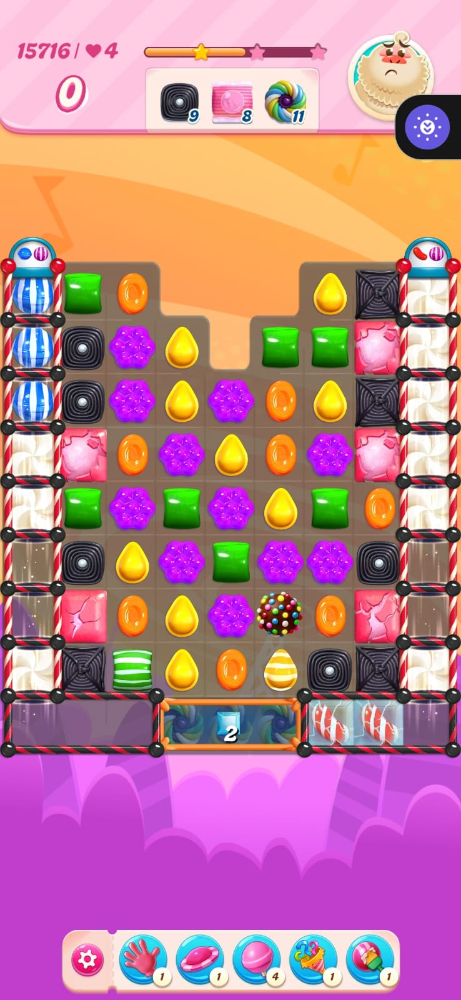
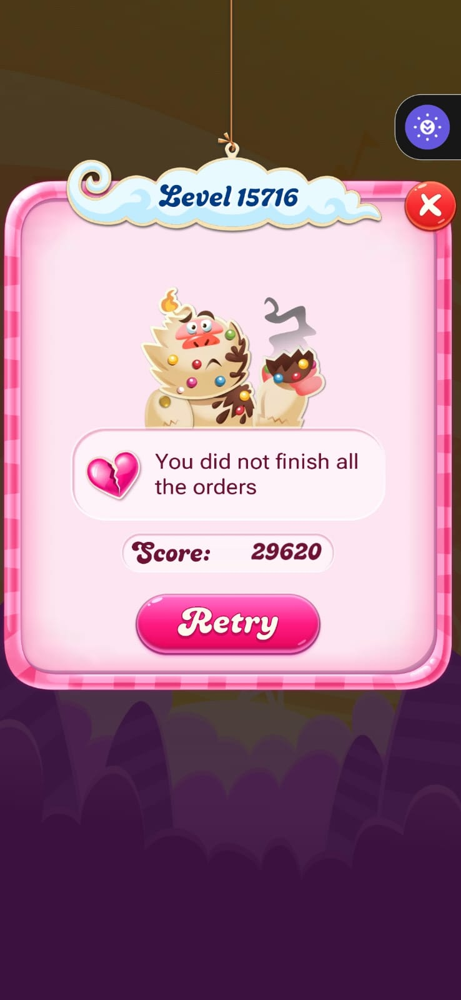
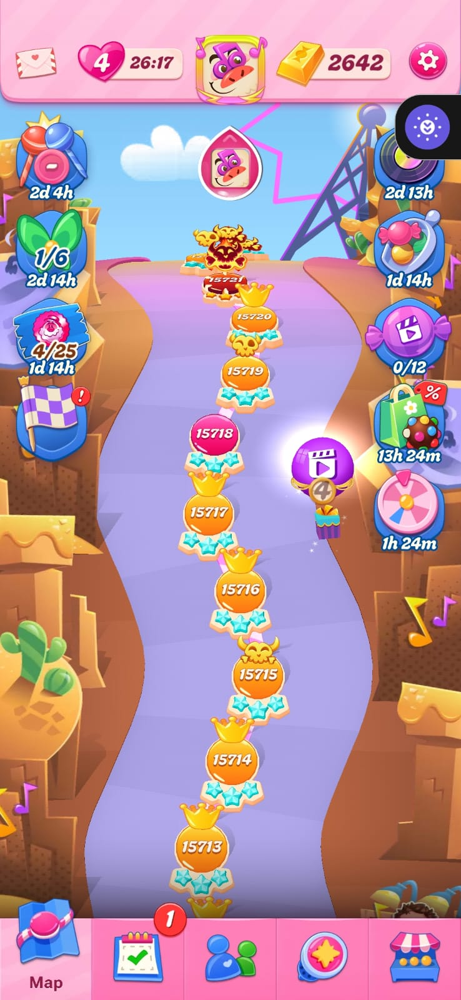

1. [M1, M2, M3, M7] · Level 15627 with 29 moves left, three orders at the top (6, 10, 33), blockers on the board and the booster bar at the bottom.
2. [M2, M3, M4, M5, M7] · Level 15716 with 3 moves left, one star lit, orders at 11/11/11 and a striped-candy blast clearing a cross-shaped area.
3. [M2, M3, M4] · Same level at 0 moves, orders still unfinished (9, 8, 11 left), a colour bomb on the board and Mr. Yeti looking upset.
4. [M3, M5, M6] · Fail screen: "You did not finish all the orders", score 29620, a broken heart and a Retry button.
5. [M5, M6] · Level map showing 4 lives with a refill timer, stars under each level and timed events on the sides.

| # | Mechanic | Dynamic | Aesthetic | Bartle type |
|---|---|---|---|---|
| M1 | Swapping two neighbouring candies is only allowed if it makes a line of 3 or more of the same colour. The line clears and new candies drop in from the top. | Players scan the board for the swap that clears the most candies or sets up the next match. | Submission: a calm, repeatable puzzle you can do while half-distracted. | Achiever: clearing the board piece by piece. |
| M2 | Each level gives a fixed number of moves (29 in Level 15627, 3 left in Level 15716), and the level ends at zero. | Players stop swapping at random and plan each move, saving the strong swaps for when moves run low. | Challenge: a limited budget means every swap has a cost. | Achiever: achieving the goal within a limit. |
| M3 | Each level has its own orders (11 of each of three items in Level 15716, or 6, 10 and 33 in Level 15627) and its own blockers such as liquorice locks and cream swirls. If any order is unfinished, the level is failed. | Players ignore random matches and aim at the order items, working out which blockers to break first on each new layout. | Challenge: a level can be lost ("You did not finish all the orders"), so finishing it means something. | Achiever: completing the level's goals. |
| M4 | Matching 4 in a line makes a striped candy, and 5 in a line makes a colour bomb. A matched striped candy blasts a full row or column. | Players hunt for these shapes on purpose and set off blasts to clear blockers that normal matches cannot reach. | Sensation: the bright cross-shaped blast gives a strong visual payoff. | Explorer: planning ahead and testing shapes and combinations to see what they do. |
| M5 | A progress bar fills with score and lights up to 3 stars. The stars you earn are saved under each level on the map. | Players replay a level they already passed to improve their score and earn the missing stars. | Challenge: one star is easy, but the third needs near-perfect play. | Achiever: stars and level completion. |
| M6 | You have a limited number of lives. A failed level costs one (5 hearts in Level 15627, 4 in Level 15716), and the map shows a countdown (26:17) for the next one to refill. | Players stop when lives run out and return later when the timer ends. | Submission: a timed loop that pulls players back at regular intervals. | Achiever: progress is gated by lives. |
| M7 | A booster bar sits under the board with a limited count of each item (a hand, a UFO, a lollipop hammer and others). | Players keep boosters for a level they are stuck on and decide when to spend them, for example when few moves are left. | Challenge: limited help forces a decision about when it is worth using. | Achiever: using resources to overcome a hard level. |

**Aesthetic profile:** Challenge leads (M2, M3, M5, M7): moves, orders and stars all make a level something you can lose. Submission comes next (M1, M6): the match loop is easy and relaxing, and the lives timer brings you back regularly. Sensation (M4) is the payoff, with big blasts and clears.

**Player types**
- Primary: Achiever (acting × world), because the game is built on goals you complete and measure: orders, stars, move limits and lives (M2, M3, M5, M6).
- Secondary: Explorer (interacting × world), because players plan ahead and test candy shapes and combos to see what works (M4).

## Level blockouts
| Level | Screenshot | Its idea | Wayfinding tool |
|---|---|---|---|
| Level01 | 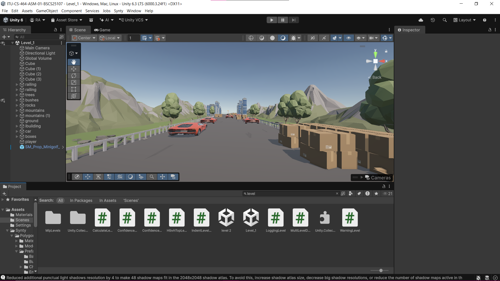 |Track Navigation & Layout | Different hurdles and a flag at the final mark|
| Level02 | 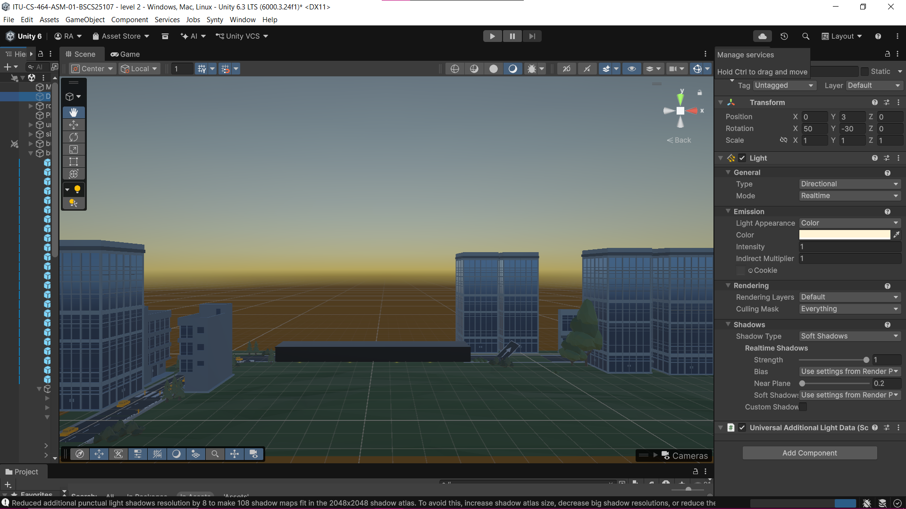 | | |
| Level03 | 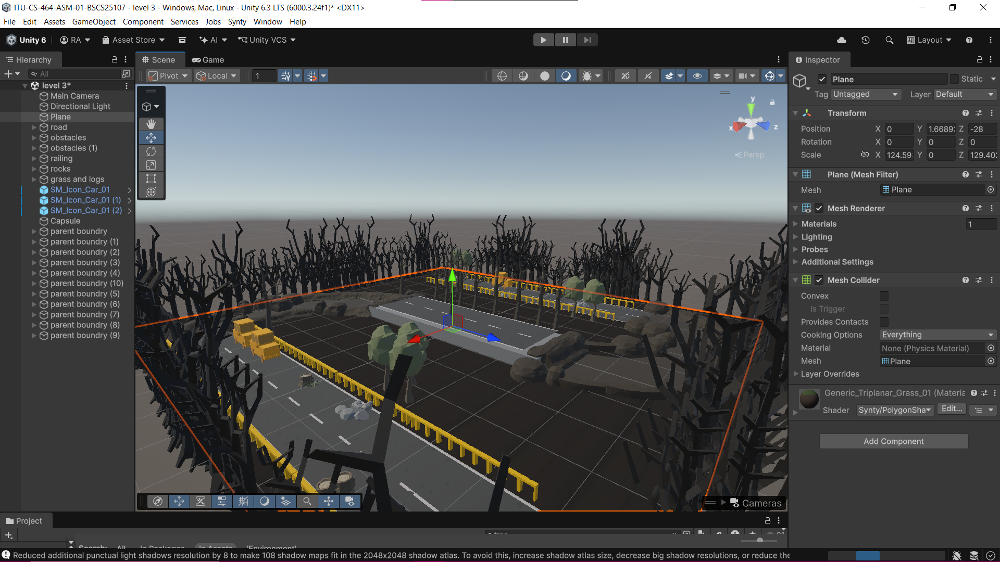 | | |
| Level04 | 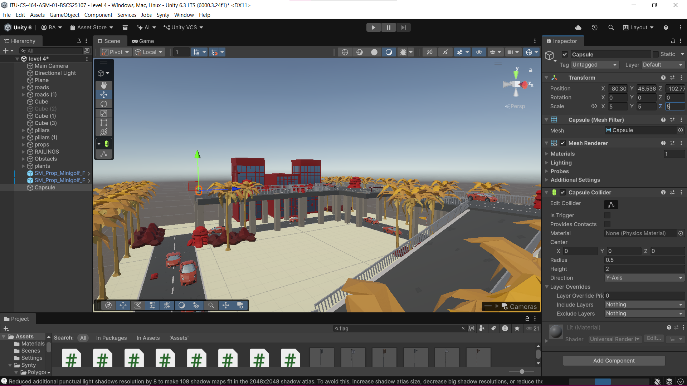 | | |
| Level05 | 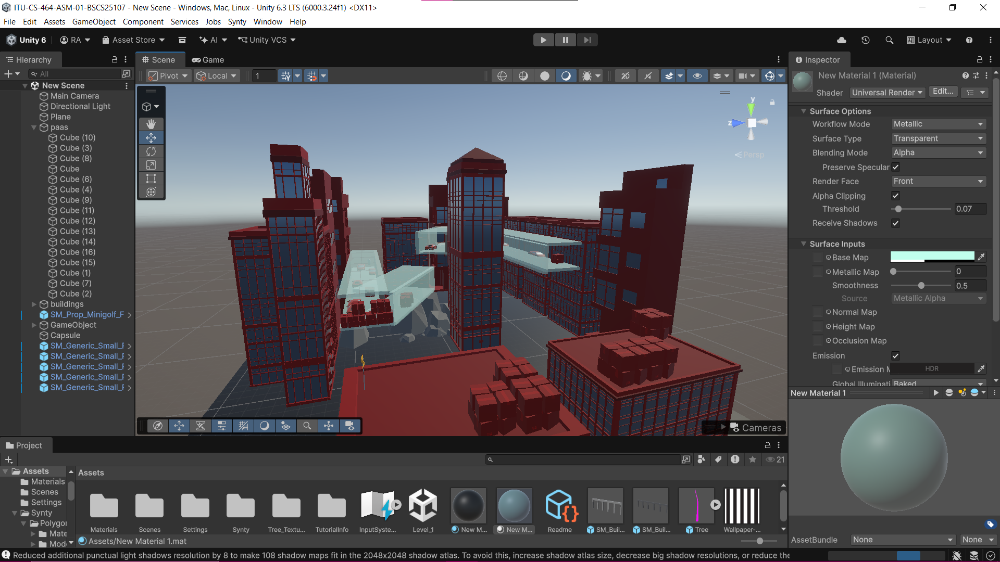 | | |
